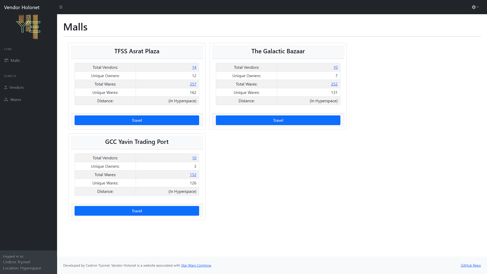
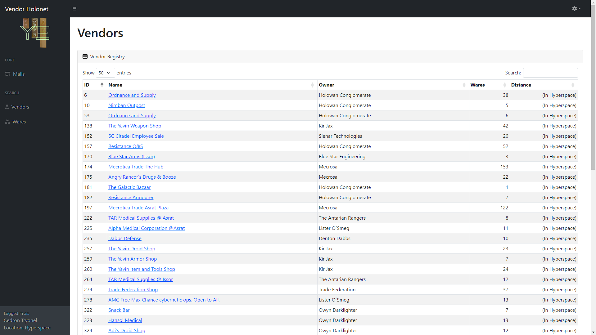
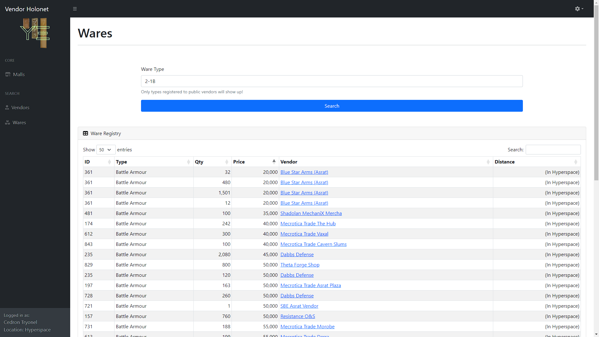
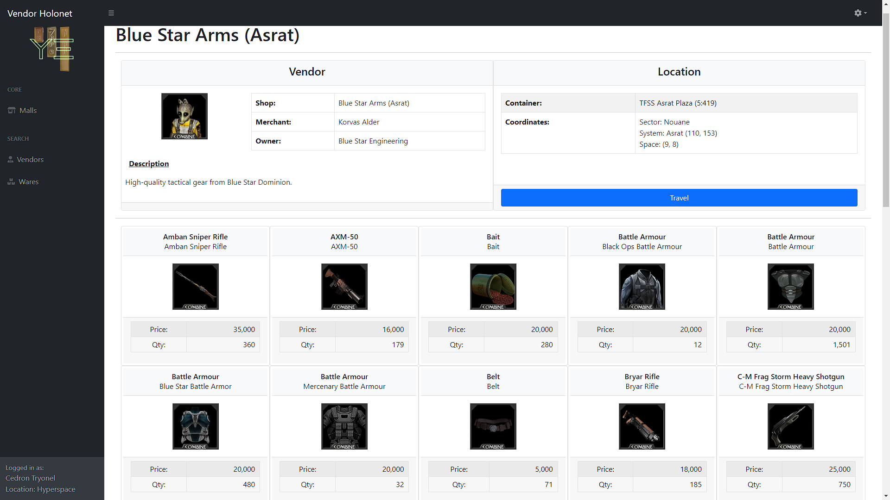

# Vendor Holonet
Star Wars Combine Vendor Holonet

### Features

- Integration with swcombine.com API to handle login and data collection
- Browse public-access vendors and wares in sleek and organized datatables
- Detect vendor malls based on criteria in the Mall.php class
- Calculate distance of vendors/wares/malls from the character

## Installation

1. Download this Git repository
2. Ensure your web server has a domain name and utilizes https (recommend certbot on Linux system for easy SSL cert setup)
3. Setup your mysql database and import the /database/id20150352_vendor_holonet.sql file
4. Register your new application at https://www.swcombine.com/ws/registration/
5. Rename config.example.php to config.php and adjust parameters accordingly to connect to your database and the SWC API endpoint
6. Setup cron job for the vendor data: 0 */8 * * * /usr/bin/php /var/www/html/scripts/updateVendors.php
7. Setup cron job for session purging: 0,10,20,30,40,50 * * * * /usr/bin/php /var/www/html/scripts/purgeSessions.php

## Examples

### Malls

### Vendors

### Wares

### Vendor Profile

